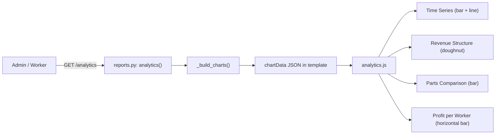

# Analytics

The analytics page (`/analytics`) provides interactive Chart.js dashboards for profit and parts-price analysis over a custom date range. It combines server-side data preparation (in `app/reports.py`) with client-side Chart.js rendering (in `app/static/js/analytics.js`).

## Architecture

## Server-Side: `_build_charts()`

Located in `app/reports.py`, this function assembles chart data:

1. **Time bucketing** — for ranges ≤ 62 days, creates daily buckets; for longer ranges, switches to monthly buckets. Each bucket accumulates total revenue and profit.
2. **Labels** — daily: `"5.7."` format; monthly: `"jul 2026"` using Serbian month abbreviations from `SR_MONTHS`.
3. **Revenue structure** — splits total into parts (retail) and labor.
4. **Parts comparison** — three bars: retail price, cost (with discount), and margin.
5. **Per-worker breakdown** — only included when viewing the whole shop (`worker is None`); shows each worker's profit, sorted descending.

The resulting `charts` dict is serialized as JSON into a `<script id="chartData">` element in the template.

## Client-Side: `analytics.js`

The IIFE in `analytics.js` parses the JSON from `#chartData` and renders four charts:

1. **`#chTime`** — combo chart with bar (revenue) and line (profit) datasets, time labels on x-axis, money formatting on y-axis using Serbian locale (`sr-RS`)
2. **`#chStruct`** — doughnut chart with "Delovi (prodajna)" and "Rad" segments
3. **`#chParts`** — bar chart with three colored bars: retail (blue), cost (red), margin (green)
4. **`#chWorker`** — horizontal bar chart (only rendered when `d.byworker` is present), showing profit per worker

All tooltips use a custom `money()` formatter that displays values like `12.345 RSD` using the currency from the chart data.

## Scope & Date Range

- Workers see only their own data; admins can switch between "me", a specific worker, or "all"
- Custom start/end dates via URL parameters (default: 1st of current month to today)
- Scope resolution handled by `_resolve_scope()` in [Reports & Journals](../files/app/reports.md)

## How It Connects

- Data comes from [Reports & Journals](../files/app/reports.md) (`analytics()` route and `_build_charts()`)
- Pricing properties from [Data Models](../files/app/models.md)
- Chart rendering in [Frontend & Static Assets](../modules/app/static/js.md) (`analytics.js`)
- Chart.js library bundled as `chart.umd.min.js` in static assets

# Citations
- app/reports.py:214-263
- app/reports.py:19-78
- app/static/js/analytics.js:1-74
