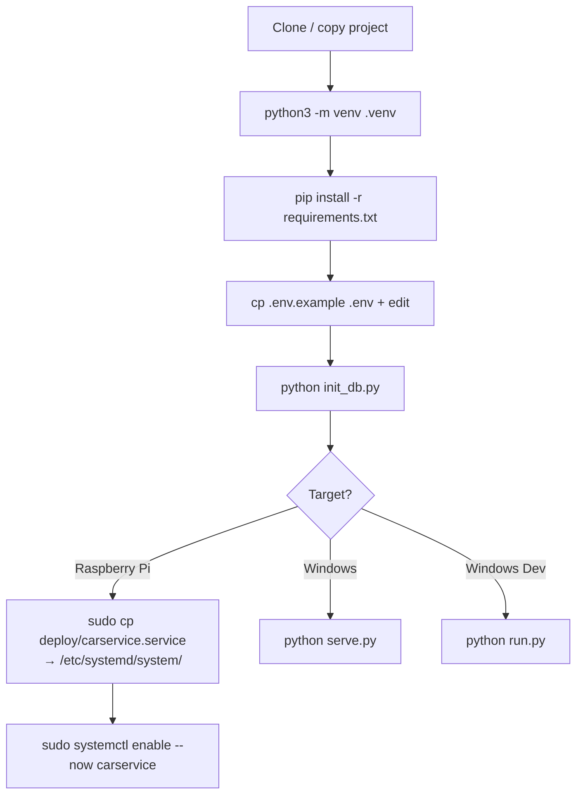

# Deployment

Auto Servis supports two deployment modes: production on a **Raspberry Pi Zero 2W** (or any Linux box) and development on **Windows**. Both use the same codebase.

## Server Scripts

### `serve.py` — Production Server
Uses **Waitress**, a pure-Python WSGI server (no C extensions needed):

```
python serve.py
```

- Listens on `0.0.0.0:8000` by default
- Configurable via env vars: `HOST`, `PORT`, `THREADS` (default 4)
- Calls `create_app()` from [App Factory](../modules/app.md)

### `run.py` — Development Server
Uses Flask's built-in dev server with auto-reload and debug mode:

```
python run.py
```

- Listens on `0.0.0.0:8000`
- Debug mode enabled (`app.run(debug=True)`)
- Not for production use

## Database Initialization: `init_db.py`

```
python init_db.py            # create tables only
python init_db.py --demo     # create tables + seed demo data
python init_db.py --reset    # drop all tables first (destructive!)
```

Demo data includes:
- Two users: `admin` (admin123) and `radnik` (radnik123)
- A company: "Auto Servis Petrović" with address and contact
- Two cars: BMW 320 (NS123AB) and VW Golf 7 (BG456CD)
- Three service records with parts

## Deployment Flow



## Raspberry Pi Deployment

For a Raspberry Pi Zero 2W (Debian-based):

1. Install Python: `sudo apt install python3-venv python3-pip`
2. Clone to `/home/pi/carservice`
3. Create venv + install deps
4. Configure `.env` (especially `SECRET_KEY`, SMTP settings)
5. Initialize DB: `.venv/bin/python init_db.py`
6. Copy the systemd unit file and enable the service
7. Access via `http://<pi-ip>:8000`

For automatic journal emails, set `ENABLE_SCHEDULER=true` in `.env`. See [Background Scheduler](scheduler.md).

## Environment Configuration (`.env`)

Key settings (see [App Factory & Configuration](../modules/app.md) for full list):

| Variable | Required | Purpose |
|----------|----------|---------|
| `SECRET_KEY` | Yes (production) | Flask session signing |
| `SMTP_HOST` | For email | SMTP server for journals |
| `SMTP_PORT` | For email | Default 587 |
| `SMTP_USER` / `SMTP_PASSWORD` | For email | SMTP credentials |
| `ENABLE_SCHEDULER` | Optional | Auto journal/backup jobs |
| `CURRENCY` | Optional | Display currency (default RSD) |
| `PORT` | Optional | Server port (default 8000) |

## Dependencies

From `requirements.txt`:
- Flask ≥3.0, Flask-SQLAlchemy ≥3.1, Flask-Login ≥0.6, Flask-WTF ≥1.2
- SQLAlchemy ≥2.0, Werkzeug ≥3.0
- Pillow ≥10.0 (image processing)
- Waitress ≥3.0 (production WSGI)
- APScheduler ≥3.10 (background jobs)
- python-dotenv ≥1.0 (env file loading)
- xhtml2pdf ≥0.2.11 (PDF generation)

## How It Connects

- `serve.py` and `run.py` both call `create_app()` from [App Factory & Configuration](../modules/app.md)
- `init_db.py` imports models from [Data Models](../files/app/models.md) and extensions
- Scheduler config documented in [Background Scheduler](scheduler.md)
- Security settings in [Security Architecture](security.md)

# Citations
- serve.py:1-20
- run.py:1-15
- init_db.py:1-97
- requirements.txt:1-12
- README.md:42-59
- README.md:73-89
