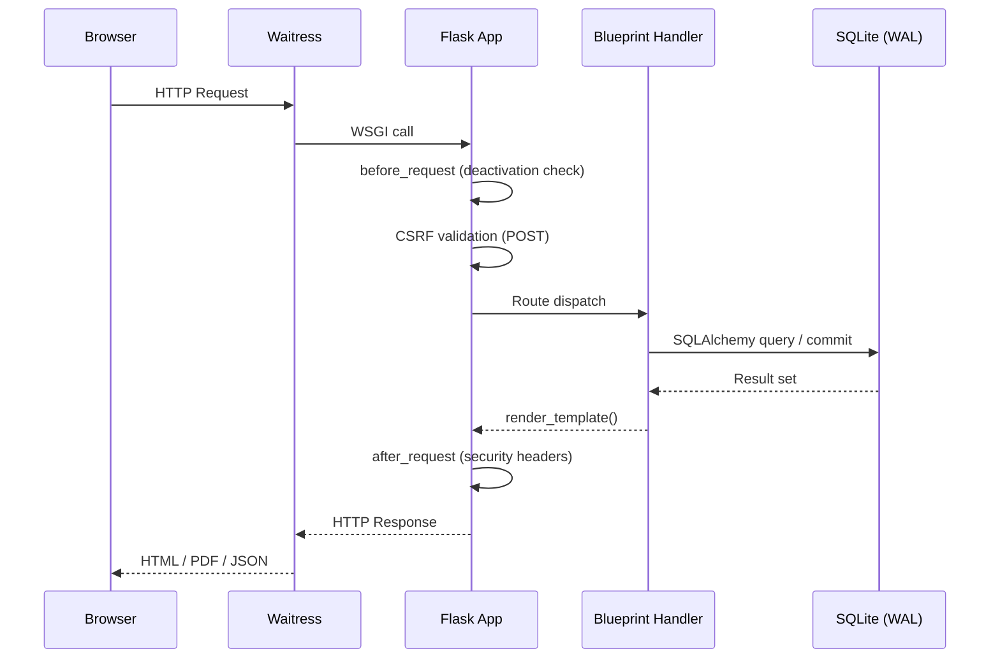
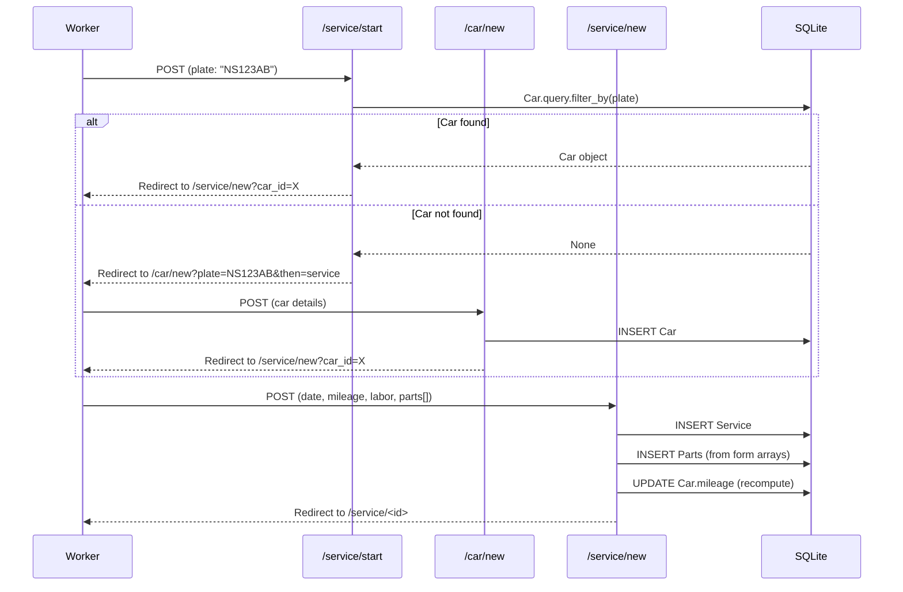
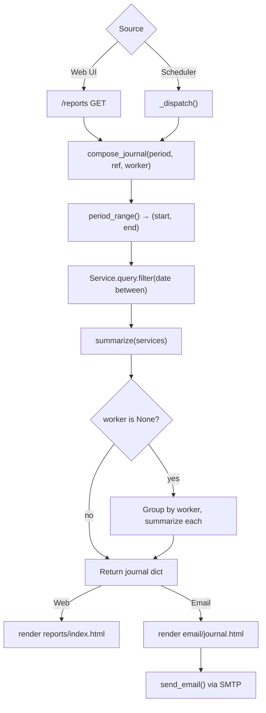
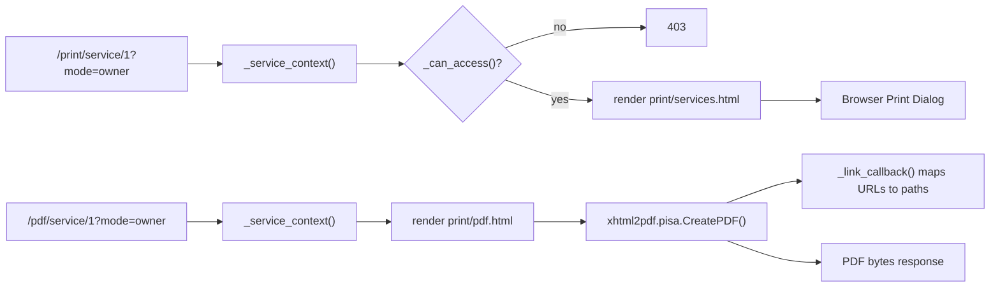

# Data Flow

This page traces the key data flows through the Auto Servis application — from HTTP request to database and back.

## Request Lifecycle

## Plate-First Service Creation

The primary business workflow — creating a new service record:

## Journal Generation Flow

How journals are produced (both on-demand and scheduled):

## Print & PDF Pipeline

## Data Access Patterns

| Blueprint | Reads | Writes |
|-----------|-------|--------|
| `auth_bp` | User | User |
| `main_bp` | Service, Car, Company | Company |
| `cars_bp` | Car, Service | Car |
| `services_bp` | Car, Service, Part | Service, Part, Car (mileage) |
| `reports_bp` | Service, User | — |
| `print_bp` | Service, Car | — |
| `backup_bp` | — (raw SQLite) | Filesystem (zip) |

## How It Connects

- Blueprint details: [Authentication](../files/app/auth.md), [Dashboard](../files/app/main.md), [Cars](../files/app/cars.md), [Services](../files/app/services.md), [Reports](../files/app/reports.md), [Printing](../files/app/printing.md), [Backup](../files/app/backup.md)
- Data model: [Data Models](../files/app/models.md)
- Security hooks: [Security Architecture](security.md)
- Scheduler trigger: [Background Scheduler](scheduler.md)
- Server entry: [Deployment](build-and-deploy.md)

# Citations
- app/__init__.py:62-67
- app/__init__.py:92-112
- app/services.py:42-89
- app/reports.py:120-160
- app/printing.py:42-73
- app/pdf.py:48-56
