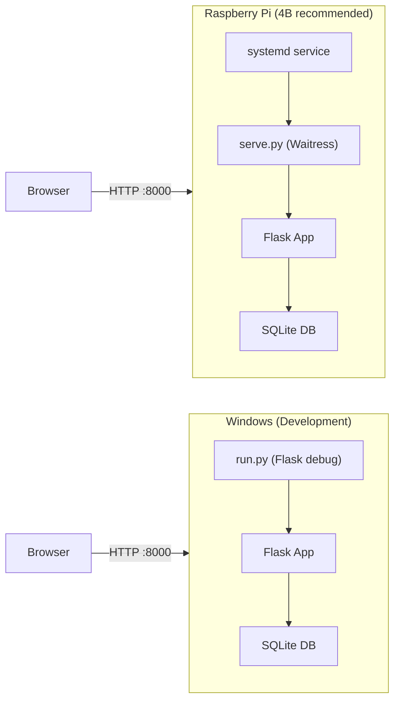

# Deployment

GaragePro supports two deployment targets: **Raspberry Pi** (production, recommended Pi 4B 2GB+) and **Windows** (development/testing).

## Deployment Architecture



## Production: Raspberry Pi

### One-Command Install

Clone the repo and run the installer — it handles everything automatically:

```bash
git clone <repo-url> /tmp/garagepro
cd /tmp/garagepro
mv deploy/install-garagepro.txt deploy/install-garagepro.sh
chmod +x deploy/install-garagepro.sh
sudo bash deploy/install-garagepro.sh
```

The installer:
1. Installs system packages (Python 3, Tesseract OCR, image libraries)
2. Creates a dedicated `garagepro` system user
3. Deploys the app to `/opt/garagepro`
4. Creates a Python venv and installs pip packages
5. Generates `.env` with a random `SECRET_KEY`
6. Initializes the SQLite database with demo data
7. Installs and starts a `garagepro` systemd service
8. Configures zram swap on low-RAM Pi models (≤1 GB)
9. Sets up daily automatic backups at 03:00

After install, open `http://<pi-ip>:8000` — default login: `admin` / `admin123`.

### Recommended Hardware

| Model | RAM | Verdict |
|-------|-----|--------|
| Pi Zero 2W | 512 MB | Works for basic use, OCR may OOM |
| **Pi 4B (2 GB)** | **2 GB** | **Sweet spot — all features including OCR** |
| Pi 4B (4/8 GB) | 4–8 GB | Overkill unless running other services |

Tip: boot from a USB SSD instead of microSD for better SQLite write performance.

### Manual Setup (alternative)

1. Install Python venv: `sudo apt install python3-venv python3-pip`
2. Clone the repo to `/opt/garagepro`
3. Create virtualenv and install dependencies:
   ```bash
   python3 -m venv venv
   venv/bin/pip install -r requirements.txt
   ```
4. Copy `.env.example` to `.env` and configure `SECRET_KEY`, SMTP settings, etc.
5. Initialize the database: `venv/bin/python init_db.py --seed`
6. Install the systemd service from `deploy/garagepro-service.txt`

The app listens on port `8000` and is accessible from other devices on the network.

### Uninstall

```bash
mv deploy/uninstall-garagepro.txt deploy/uninstall-garagepro.sh
sudo bash deploy/uninstall-garagepro.sh
```

Removes the service, cron job, and system user. Optionally deletes `/opt/garagepro` (with a final DB backup to `/tmp/`).

### Production Server (`serve.py`)

Uses **Waitress** — a pure-Python WSGI server that works on both Linux and Windows:

- Default: `0.0.0.0:8000` with 4 threads
- Configurable via `HOST`, `PORT`, `THREADS` environment variables
- No external web server (nginx) required, though ProxyFix is available when `TRUST_PROXY=true`

### Automatic Journals + Backups

Set `ENABLE_SCHEDULER=true` in `.env` to activate the [Background Scheduler](scheduler.md):
- Daily journal at 20:00, weekly on Sundays, monthly on the last day
- Nightly backup at 02:30

## Development: Windows

### Quick Start

Double-click `run_windows.bat` (creates venv, installs deps, seeds demo data, starts server).

Or manually:
```powershell
python -m venv .venv
.\.venv\Scripts\activate
pip install -r requirements.txt
python init_db.py --demo
python run.py
```

Open `http://127.0.0.1:8000`.

### Development Server (`run.py`)

Uses Flask's built-in development server with `debug=True` (auto-reload on code changes).

## Database Initialization (`init_db.py`)

| Flag | Effect |
|------|--------|
| (none) | Create tables only |
| `--demo` | Create tables + seed demo data |
| `--reset` | Drop all tables first (destructive) |

### Demo Data

When `--demo` is used, seeds:
- **Shop:** Auto Servis Petrović (tenant)
- **Moderator user:** `moderator` / `moderator123` (System Moderator)
- **Admin (owner) user:** `admin` / `admin123` (Marko Petrović, assigned to shop)
- **Worker user:** `radnik` / `radnik123` (Jovan Jovanović, assigned to shop)
- **Company:** Auto Servis Petrović, Novi Sad (legacy backward compat row)
- **2 cars:** BMW 320 (NS123AB) and VW Golf 7 (BG456CD)
- **5 services** across three types (mali servis, popravke, vulkanizerski) with realistic parts and labor

Without `--demo`, the database is empty — the first registered user becomes **moderator**.

## Environment Configuration

See [Configuration](configuration.md) for the full list of `.env` settings. Key production settings:

- `SECRET_KEY` — **must change** from default
- `SMTP_*` — required for journal e-mailing
- `ENABLE_SCHEDULER` — `true` for automatic journals/backups
- `SECURE_COOKIES` — `true` when serving over HTTPS
- `TRUST_PROXY` — `true` when behind nginx

## Connections

- Server scripts → `serve.py`, `run.py`
- DB initialization → `init_db.py`
- Configuration → [Configuration](configuration.md)
- Scheduler → [Background Scheduler](scheduler.md)
- Backup CLI → [Backup System](../files/app/backup.md)

# Citations

- serve.py:1
- serve.py:14
- run.py:1
- run.py:12
- init_db.py:1
- init_db.py:19
- init_db.py:82
- README.md:42
- README.md:71
- README.md:61
