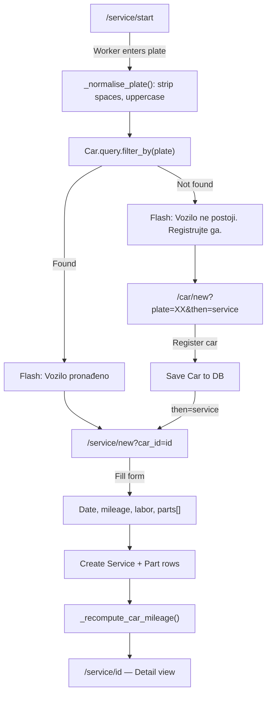

# Plate-First Service Flow

The plate-first flow is the primary operational workflow in Auto Servis. Instead of browsing a car list and then creating a service, the worker **starts by typing the car's license plate**. The system then determines whether the car exists and guides the worker to the right next step.

## Flow Diagram

## Step-by-Step

### 1. Enter Plate (`/service/start`)
The worker navigates to the start page and enters a license plate. `_normalise_plate()` strips whitespace and uppercases the input (e.g. `"ns 123 ab"` → `"NS123AB"`).

**Source**: [Service Records](../files/app/services.md) — `start()` route at `app/services.py:41`.

### 2. Car Lookup
The system queries `Car.query.filter_by(plate=plate).first()`:
- **Found** → flash success message, redirect to the new-service form with `car_id`
- **Not found** → flash warning, redirect to [Car Management](../files/app/cars.md) new form with the plate pre-filled and `then=service` flag

### 3. Car Registration (if needed)
If the car doesn't exist, the worker fills in owner info, specs, and optionally a photo. On save, because `then=service` is set, the system redirects directly to `/service/new?car_id=<new_car_id>` instead of the car detail page.

**Source**: [Car Management](../files/app/cars.md) — `new()` route at `app/cars.py:45`.

### 4. Service Form
The service form collects:
- **Date** (defaults to today)
- **Mileage** reading
- **Labor price** and description
- **Parts table** — dynamic rows managed by [service_form.js](../modules/app/static/js.md), each with name, quantity, retail price, and discounted price

### 5. Save Service
`_apply_service_form()` parses date, mileage, and labor from the form. `_rebuild_parts()` creates `Part` records from the parallel arrays `part_name[]`, `part_qty[]`, `part_price[]`, `part_disc[]`.

### 6. Mileage Recomputation
After saving, `_recompute_car_mileage(car)` updates the car's `mileage` field from its most recent service (by date desc, then id desc). This ensures that editing or deleting an older service never clobbers a newer reading.

**Source**: [Service Records](../files/app/services.md) — `_recompute_car_mileage()` at `app/services.py:21`.

### 7. Redirect to Detail
The worker lands on the service detail page showing the complete record, with options to [print](../files/app/printing.md), [edit](../files/app/services.md), or [export PDF](../files/app/printing.md).

## Why Plate-First?

In a busy workshop, mechanics know the plate number but rarely the database ID. This flow minimises steps: one input field, automatic routing, and seamless integration of car registration when a new vehicle arrives.

# Citations
- app/services.py:41 (start route — plate entry point)
- app/services.py:18 (_normalise_plate — strip + uppercase)
- app/services.py:49 (Car.query.filter_by(plate) lookup)
- app/services.py:53 (redirect to services.new when found)
- app/services.py:56 (redirect to cars.new when not found, with then=service)
- app/cars.py:45 (new route — prefill plate, then=service)
- app/cars.py:78 (redirect to services.new after car creation)
- app/services.py:61 (new route — create service)
- app/services.py:21 (_recompute_car_mileage)
