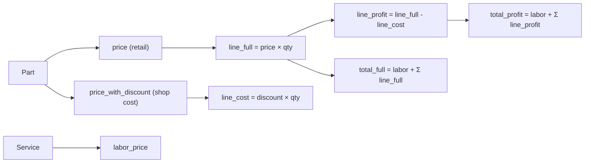

# Pricing & Profit Model

Auto Servis uses a **dual-price system** to track both what the customer pays and what the shop actually spends on parts. This is the foundation of all financial reporting, printing, and analytics.

## Price Structure



## Per-Part Calculations

Each `Part` record stores two prices:
- **`price`** — the retail/full price charged to the customer (called "cena bez popusta" / "price without discount" in the UI)
- **`price_with_discount`** — the shop's actual cost for the part (called "cena sa popustom" / "price with discount")

The naming reflects the shop's relationship with its parts suppliers: the shop gets a supplier discount, so its cost is the "discounted" price, while the customer pays the "non-discounted" (full retail) price.

Three computed properties on `Part`:

| Property | Formula | Meaning |
|----------|---------|---------|
| `line_full` | `price × quantity` | What the customer pays for this part |
| `line_cost` | `price_with_discount × quantity` | What the shop pays for this part |
| `line_profit` | `line_full - line_cost` | Shop's margin on this part |

## Per-Service Calculations

The `Service` model aggregates parts and adds labor:

| Property | Formula | Meaning |
|----------|---------|---------|
| `parts_total_full` | `Σ part.line_full` | Total retail parts cost |
| `parts_total_cost` | `Σ part.line_cost` | Total shop parts cost |
| `parts_profit` | `parts_total_full - parts_total_cost` | Total parts margin |
| `total_full` | `labor_price + parts_total_full` | **Total invoice** (customer pays) |
| `total_profit` | `labor_price + parts_profit` | **Shop profit** (labor is 100% profit) |

Note that **labor is treated as pure profit** — there's no labour cost tracking.

## Aggregation in Reports

The `summarize()` function in [Reports & Analytics](../files/app/reports.md) aggregates across services:

```python
{
    "count":        len(services),
    "parts_full":   sum(s.parts_total_full for s in services),
    "parts_cost":   sum(s.parts_total_cost for s in services),
    "parts_profit": sum(s.parts_profit for s in services),
    "labor":        sum(s.labor_price for s in services),
    "revenue":      sum(s.total_full for s in services),
    "profit":       sum(s.total_profit for s in services),
}
```

This feeds:
- **Journals** — daily/weekly/monthly summaries with total revenue and profit
- **Analytics charts** — revenue/profit over time, revenue structure, parts margin analysis, per-worker profit

## Printing Impact

The dual-price system directly controls what appears on printed documents (see [Printing & PDF Export](../files/app/printing.md)):

| Element | Customer Copy | Owner Copy |
|---------|--------------|------------|
| Part retail price | ✓ | ✓ |
| Part discount price | ✗ | ✓ |
| Part margin | ✗ | ✓ |
| Labor price | ✗ | ✓ |
| Total for payment | ✓ (parts only) | ✓ (parts + labor) |
| Profit | ✗ | ✓ |

## Design Decisions

1. **Computed properties, not stored columns** — all profit/total fields are `@property` decorators on the models. This avoids stale data and ensures consistency, at the cost of computing sums on every access. Acceptable for a small shop's volume.

2. **Labor = 100% margin** — the app doesn't track the mechanic's hourly cost. Labor price goes entirely to profit. This simplifies the model while matching how many small shops think about pricing.

3. **No tax tracking** — all prices are treated as final amounts. Tax/VAT handling is outside the scope.

# Citations
- app/models.py:127 (Part class — price, price_with_discount)
- app/models.py:135 (Part.line_full property)
- app/models.py:139 (Part.line_cost property)
- app/models.py:143 (Part.line_profit property)
- app/models.py:106 (Service.parts_total_full property)
- app/models.py:110 (Service.parts_total_cost property)
- app/models.py:114 (Service.parts_profit property)
- app/models.py:118 (Service.total_full property)
- app/models.py:122 (Service.total_profit property)
- app/reports.py:79 (summarize function — aggregation)
- README.md:108 (pricing model documentation)
