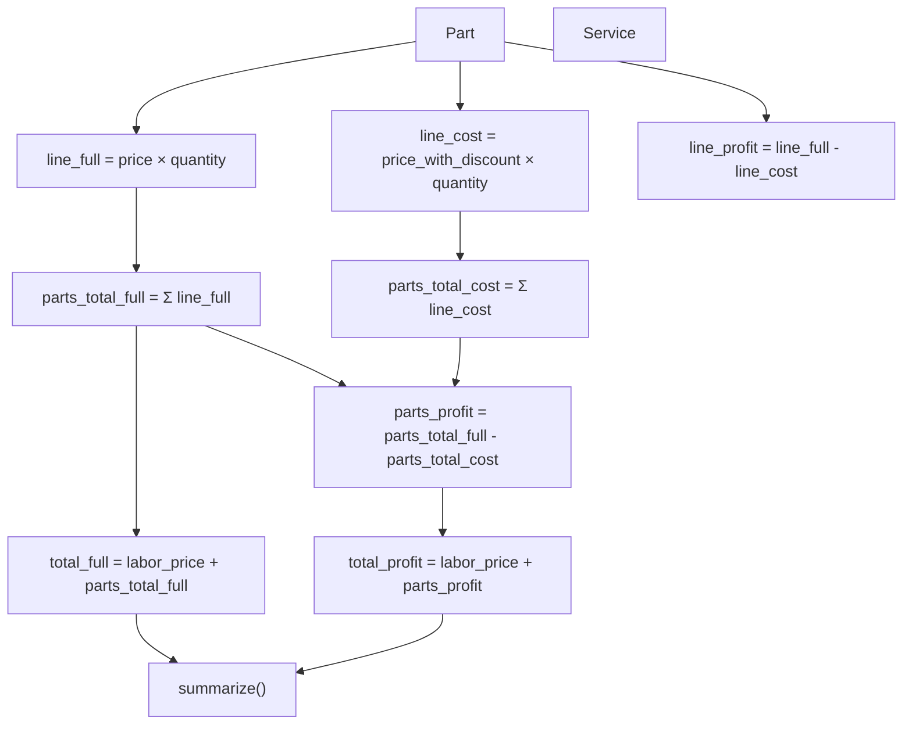

# Pricing & Profit Model

Auto Servis uses a dual-price system for parts to track both what the customer pays and what the workshop's actual cost is. This enables accurate profit calculation at every level.

## The Two Prices

Every `Part` has two price fields:

| Field | Meaning | Who pays it |
|-------|---------|-------------|
| `price` | Retail / full price (without discount) | Customer |
| `price_with_discount` | Discounted / cost price | Workshop (supplier cost) |

The **margin on parts** is the difference: `price - price_with_discount`.

## Calculation Flow

### Part Level

- `line_full` = `price × quantity` — what the customer pays for this line
- `line_cost` = `price_with_discount × quantity` — workshop's cost
- `line_profit` = `line_full - line_cost` — margin on this part

### Service Level

- `parts_total_full` = sum of all `line_full` — total parts at retail
- `parts_total_cost` = sum of all `line_cost` — total parts at cost
- `parts_profit` = `parts_total_full - parts_total_cost` — total parts margin
- `total_full` = `labor_price + parts_total_full` — **what the customer pays**
- `total_profit` = `labor_price + parts_profit` — **workshop profit**

Note: labor is treated as 100% profit (no labor cost tracking).

### Report Level

`summarize()` in [Reports & Analytics](../files/app/reports.md) aggregates across multiple services:

| Metric | Formula |
|--------|---------|
| `count` | Number of services |
| `parts_full` | Σ `parts_total_full` |
| `parts_cost` | Σ `parts_total_cost` |
| `parts_profit` | Σ `parts_profit` |
| `labor` | Σ `labor_price` |
| `revenue` | Σ `total_full` |
| `profit` | Σ `total_profit` |

## How Pricing Appears in Output

### Customer Print Copy

Shows parts at **retail price only** (`price × quantity`). No labor price, no discounted prices, no profit. The customer sees only what they're paying for parts.

### Owner Print Copy

Shows **both prices** for each part (retail and discounted), labor price, and total profit. Full financial transparency for the workshop owner.

### Dashboard

Shows `total_full` (revenue) and `total_profit` for today and the current month.

### Analytics Charts

- **Revenue structure:** parts (retail) vs. labor
- **Parts comparison:** retail vs. cost vs. margin
- **Revenue/profit over time:** `total_full` and `total_profit` per day/month

## Connections

- Model properties → [Data Models](../files/app/models.md) (`Service`, `Part`)
- Report aggregation → [Reports & Analytics](../files/app/reports.md) (`summarize`)
- Print formatting → [Printing & PDF Export](../files/app/printing.md)
- Dashboard stats → [Dashboard & Setup](../files/app/main.md)
- Currency display → [Utilities](../files/app/utils.md) (`format_currency`)

# Citations

- app/models.py:105
- app/models.py:109
- app/models.py:113
- app/models.py:117
- app/models.py:121
- app/models.py:126
- app/models.py:134
- app/models.py:140
- app/models.py:144
- app/models.py:148
- app/reports.py:80
