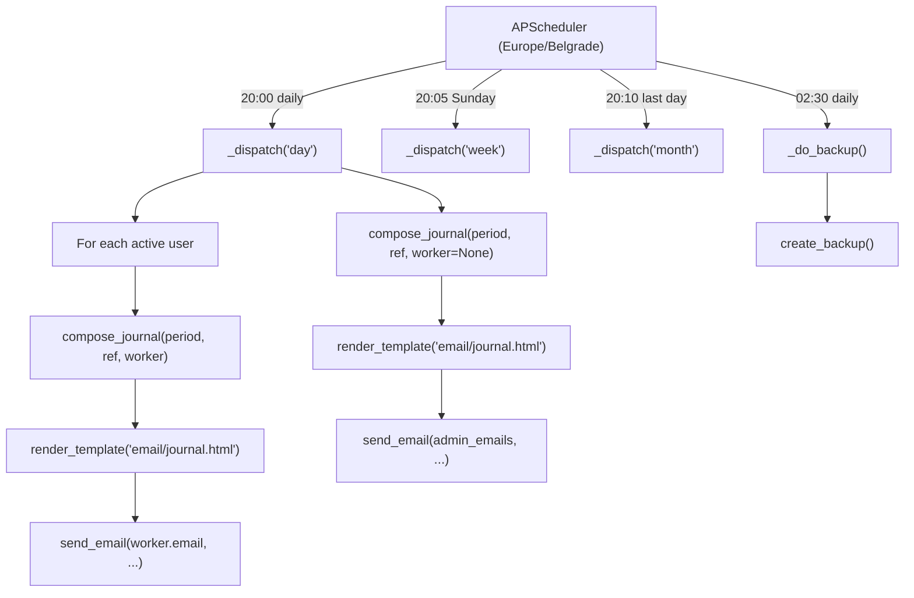

# Scheduler & Email

Auto Servis can run background jobs for automatic journal delivery and nightly database backups. This is powered by **APScheduler** (`BackgroundScheduler`) and configured via the `ENABLE_SCHEDULER` setting.

## Scheduler (`app/scheduler.py`)

### `start_scheduler(app)`

Called from [App Factory](../modules/app.md) when `ENABLE_SCHEDULER=true`. Creates a `BackgroundScheduler` with timezone `Europe/Belgrade` and registers four cron jobs:

| Job ID | Schedule | Action |
|--------|----------|--------|
| `daily` | Every day at 20:00 | Send daily journals |
| `weekly` | Every Sunday at 20:05 | Send weekly journals |
| `monthly` | Last day of month at 20:10 | Send monthly journals |
| `backup` | Every day at 02:30 | Create a database backup |

### `_dispatch(app, period, ref)`

The journal dispatch function, called by the three journal jobs:

1. **Per-worker journals** — iterates all active users. For each worker with an email and at least one service in the period, calls `compose_journal()` from [Reports & Analytics](../files/app/reports.md) and sends the rendered HTML via `send_email()`. Workers receive only their own journal.

2. **Overall journal** — generates a whole-shop journal (`worker=None`) and sends it to all active admins. This summary includes a per-worker breakdown.

Errors are logged but don't crash the scheduler — each send is wrapped in a `try/except`.

### `_do_backup(app)`

Calls `create_backup()` from [Backup System](../files/app/backup.md) inside an app context. Errors are logged as warnings.

## Job Flow

## Email Utility (`app/email_utils.py`)

### `send_email(to_addrs, subject, html_body)`

A thin SMTP wrapper:
- Reads SMTP config from the app: `SMTP_HOST`, `SMTP_PORT`, `SMTP_USER`, `SMTP_PASSWORD`, `SMTP_FROM`, `SMTP_TLS`
- Creates a `MIMEMultipart("alternative")` message with an HTML body
- For port 465: uses `SMTP_SSL`; otherwise `SMTP` with optional `STARTTLS`
- Authenticates if `SMTP_USER` is set
- Raises `RuntimeError` if `SMTP_HOST` is empty or no recipients have email addresses

## Configuration

| Setting | Default | Purpose |
|---------|---------|---------|
| `ENABLE_SCHEDULER` | `false` | Master toggle for background jobs |
| `SMTP_HOST` | (empty) | SMTP server hostname |
| `SMTP_PORT` | `587` | SMTP port (587 for STARTTLS, 465 for SSL) |
| `SMTP_USER` | (empty) | SMTP authentication username |
| `SMTP_PASSWORD` | (empty) | SMTP authentication password |
| `SMTP_FROM` | `servis@example.com` | Sender email address |
| `SMTP_TLS` | `true` | Enable STARTTLS |

## Deployment Notes

- On the **Raspberry Pi**, `ENABLE_SCHEDULER=true` is set in the systemd service file, so journals and backups run automatically.
- On **Windows** (development), the scheduler is off by default. Journals can still be sent manually via the [Reports](../files/app/reports.md) UI.
- As an alternative to the built-in scheduler, a systemd timer or cron job can call the `/reports/send` endpoint or the `backup.py` CLI script (see [Deployment](deployment.md)).

# Citations
- app/scheduler.py:49 (start_scheduler — cron job registration)
- app/scheduler.py:53 (daily job at 20:00)
- app/scheduler.py:55 (weekly job at 20:05 Sunday)
- app/scheduler.py:57 (monthly job on last day)
- app/scheduler.py:59 (backup job at 02:30)
- app/scheduler.py:14 (_dispatch — per-worker + overall journal sending)
- app/scheduler.py:64 (_do_backup — backup wrapper)
- app/email_utils.py:9 (send_email function)
- app/email_utils.py:28 (SMTP_SSL for port 465, else SMTP + STARTTLS)
- app/config.py:57 (SMTP settings)
- app/config.py:65 (ENABLE_SCHEDULER setting)
