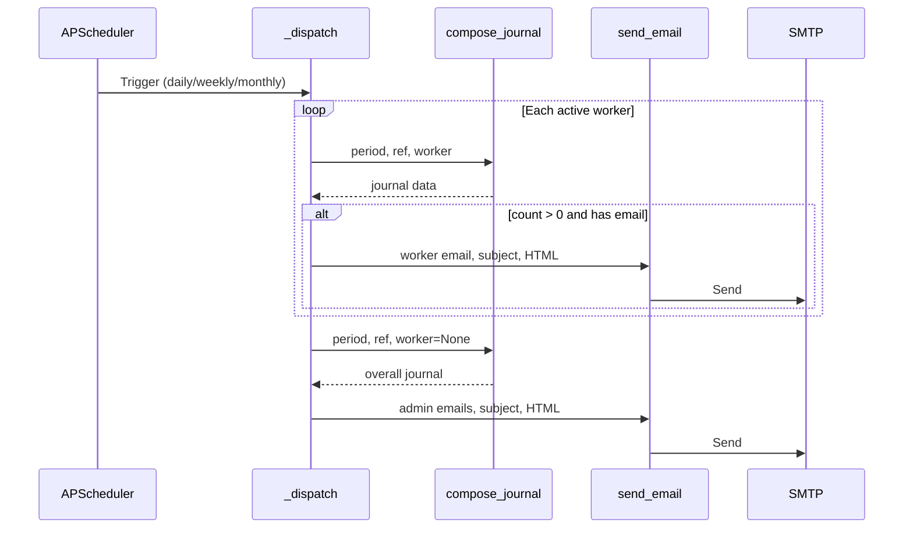

# Background Scheduler

`app/scheduler.py` provides an optional APScheduler-based background scheduler that automates journal e-mailing and database backups. It is enabled by setting `ENABLE_SCHEDULER=true` in the environment (see [Configuration](configuration.md)).

## Scheduled Jobs

| Job ID | Schedule | Timezone | Action |
|--------|----------|----------|--------|
| `daily` | Every day at 20:00 | Europe/Belgrade | E-mail daily journal |
| `weekly` | Every Sunday at 20:05 | Europe/Belgrade | E-mail weekly journal |
| `monthly` | Last day of month at 20:10 | Europe/Belgrade | E-mail monthly journal |
| `backup` | Every day at 02:30 | Europe/Belgrade | Create database backup |

## Journal Dispatch (`_dispatch`)

For each scheduled journal period, `_dispatch()`:

1. **Per-worker journals:** iterates all active users, calls `compose_journal()` for each, and sends the result to the worker's e-mail address. Skipped if the worker has no e-mail or zero services in the period.
2. **Overall journal:** calls `compose_journal()` with `worker=None` (shop-wide), and sends it to all active admin e-mail addresses.

## Backup Job (`_do_backup`)

Calls `create_backup()` from [Backup System](../files/app/backup.md) within an app context. Logs success or failure.

## Initialization

`start_scheduler(app)` creates a `BackgroundScheduler` with `timezone="Europe/Belgrade"`, registers all four jobs, and starts it. Called from `create_app()` in the [Application Factory](../modules/app.md) when `ENABLE_SCHEDULER` is truthy.

The scheduler runs in the Waitress process. On the Pi, this keeps everything self-contained without needing external cron or systemd timers.

## Error Handling

Each job catches all exceptions and logs warnings rather than crashing the scheduler, ensuring one failed e-mail doesn't prevent subsequent jobs from running.

## Connections

- Journal logic from → [Reports & Analytics](../files/app/reports.md) (`compose_journal`)
- E-mail sending → `app/email_utils.py`
- Backup function → [Backup System](../files/app/backup.md) (`create_backup`)
- Enabled via → [Configuration](configuration.md) (`ENABLE_SCHEDULER`)
- Started by → [Application Factory](../modules/app.md)

# Citations

- app/scheduler.py:1
- app/scheduler.py:14
- app/scheduler.py:22
- app/scheduler.py:37
- app/scheduler.py:51
- app/scheduler.py:58
- app/scheduler.py:67
