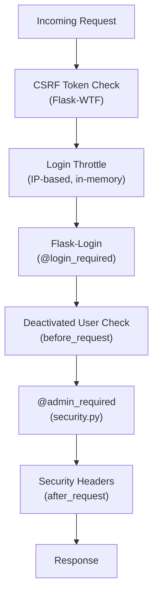

# Security Architecture

Auto Servis implements multiple layers of security appropriate for a small-shop web application running on a local network (Raspberry Pi) or the internet.

## Security Layers



## CSRF Protection

Global CSRF protection via `CSRFProtect` (Flask-WTF):
- All forms include a `csrf_token` hidden field
- POST requests without a valid token receive HTTP 400 with a dedicated error template (`errors/csrf.html`)
- Token lifetime set to `None` (valid for the entire session, not time-limited)

## Login Throttling

Implemented in `app/auth.py` using an in-memory dictionary (`_login_failures`) keyed by client IP:

- After `LOGIN_MAX_ATTEMPTS` (default 8) failed attempts within `LOGIN_LOCKOUT_MINUTES` (default 10), the IP is temporarily blocked
- Successful login clears the failure history for that IP
- Resets on server restart (appropriate for a single-process Waitress deployment)

See [Authentication & Users](../files/app/auth.md) for details.

## Authorization

### `@login_required`

Flask-Login's decorator, applied to all routes except `/login` and `/register`. Unauthenticated users are redirected to the login page with a Serbian warning message.

### `@admin_required`

Custom decorator in `app/security.py`:

```python
def admin_required(view):
    @wraps(view)
    def wrapped(*args, **kwargs):
        if not current_user.is_authenticated or not current_user.is_admin:
            abort(403)
        return view(*args, **kwargs)
    return wrapped
```

Applied to: company setup, user management, backup management.

### Row-Level Access

Workers can only view/edit/delete their own services. Enforced by `_can_access()` helpers in `services.py` and `printing.py`.

## Deactivated User Ejection

A `before_request` hook in the [Application Factory](../modules/app.md) checks if the current user's `active` flag is `False` and logs them out immediately. This prevents deactivated users from continuing to use an existing session.

## Security Response Headers

Applied via `after_request` in the application factory:

| Header | Value | Purpose |
|--------|-------|---------|
| `X-Content-Type-Options` | `nosniff` | Prevent MIME-type sniffing |
| `X-Frame-Options` | `SAMEORIGIN` | Prevent clickjacking |
| `Referrer-Policy` | `same-origin` | Limit referrer leakage |
| `Content-Security-Policy` | `default-src 'self'; img-src 'self' data:; ...` | Restrict resource loading |

## Session Hardening

From [Configuration](configuration.md):

| Setting | Value | Effect |
|---------|-------|--------|
| `SESSION_COOKIE_HTTPONLY` | `True` | JS cannot read session cookie |
| `SESSION_COOKIE_SAMESITE` | `Lax` | Cross-site request protection |
| `SESSION_COOKIE_SECURE` | `False` (set `True` for HTTPS) | Cookie sent only over HTTPS |
| `REMEMBER_COOKIE_HTTPONLY` | `True` | Remember-me cookie also HttpOnly |
| `PERMANENT_SESSION_LIFETIME` | 12 hours | Session expiration |

## Open Redirect Prevention

In `auth.py`, the `next` parameter after login is validated: only local redirects (starting with `/`) are allowed.

## Download Security

The backup download endpoint validates filenames against `^backup_\\d{8}_\\d{6}\\.zip$` to prevent path traversal.

## Connections

- CSRF extension → [Application Factory](../modules/app.md) (`extensions.py`)
- Throttling → [Authentication & Users](../files/app/auth.md)
- Config → [Configuration](configuration.md)
- `admin_required` used by → [Dashboard & Setup](../files/app/main.md), [Authentication](../files/app/auth.md), [Backup](../files/app/backup.md)

# Citations

- app/security.py:1
- app/security.py:8
- app/__init__.py:92
- app/__init__.py:100
- app/__init__.py:106
- app/auth.py:20
- app/auth.py:26
- app/auth.py:63
- app/config.py:49
- app/extensions.py:7
