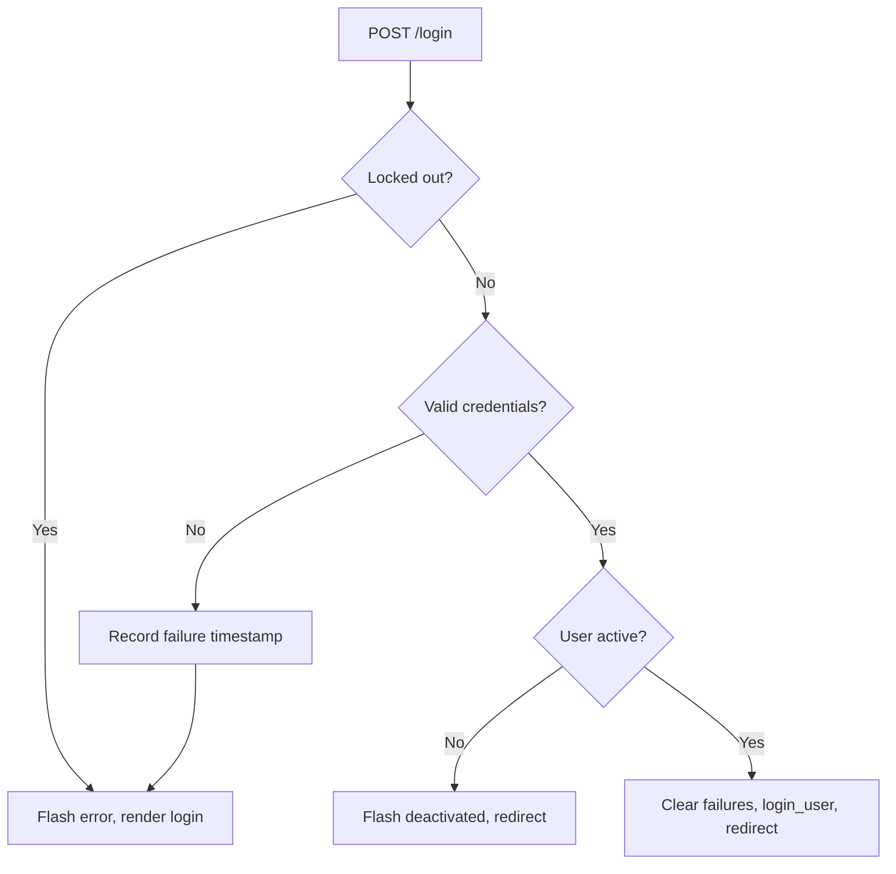

# Authentication & Users

`app/auth.py` implements the `auth_bp` blueprint handling login, logout, self-registration, and admin-only user management. Combined with `app/security.py`, it enforces a two-role access model: **admin** and **radnik** (worker).

## Role system

| Role | Constant | Capabilities |
|------|----------|-------------|
| Administrator | `ROLE_ADMIN` (`"admin"`) | Sees all services/revenue, manages users, accesses setup + backup |
| Worker | `ROLE_WORKER` (`"radnik"`) | Sees only their own services and revenue |

The **first registered user** automatically becomes admin (`User.query.count() == 0` check). All subsequent self-registrations are workers.

## Endpoints

| Route | Method | Function | Access |
|-------|--------|----------|--------|
| `/login` | GET/POST | `login()` | Public |
| `/logout` | GET | `logout()` | Logged in |
| `/register` | GET/POST | `register()` | Public |
| `/users` | GET | `users()` | Admin |
| `/users/new` | POST | `create_user()` | Admin |
| `/users/<id>/role` | POST | `toggle_role()` | Admin |
| `/users/<id>/active` | POST | `toggle_active()` | Admin |

## Login throttling

An in-memory IP-based rate limiter (`_login_failures` defaultdict) tracks failed login timestamps per client IP. After `LOGIN_MAX_ATTEMPTS` failures within `LOGIN_LOCKOUT_MINUTES`, the IP is locked out for the remaining window. The throttle resets on application restart (acceptable for a single-process Waitress deployment).

## Security helpers

`app/security.py` provides the `admin_required` decorator — a simple `@wraps`-based check that aborts with 403 if the current user is not authenticated or not an admin. Used on setup, user management, and backup routes.

## Registration validation

Self-registration enforces:
- All fields required (full name, username, email).
- Password minimum 6 characters, must match confirmation.
- Unique username and email.

Admin user creation (`create_user`) follows the same rules but allows the admin to set the role directly.

## Connections

- Uses [Data Models](models.md) — `User`, `ROLE_ADMIN`, `ROLE_WORKER`
- `admin_required` decorator used by [Dashboard & Setup](main.md), [Backup System](backup.md), [Reports & Analytics](reports.md)
- Login throttle settings from [Configuration](../architecture/configuration.md) (`LOGIN_MAX_ATTEMPTS`, `LOGIN_LOCKOUT_MINUTES`)
- Part of the [Security Architecture](../architecture/security.md)

# Citations
- app/auth.py:1
- app/auth.py:18
- app/auth.py:27
- app/auth.py:39
- app/auth.py:70
- app/auth.py:78
- app/auth.py:97
- app/auth.py:119
- app/auth.py:136
- app/auth.py:154
- app/auth.py:165
- app/security.py:1
