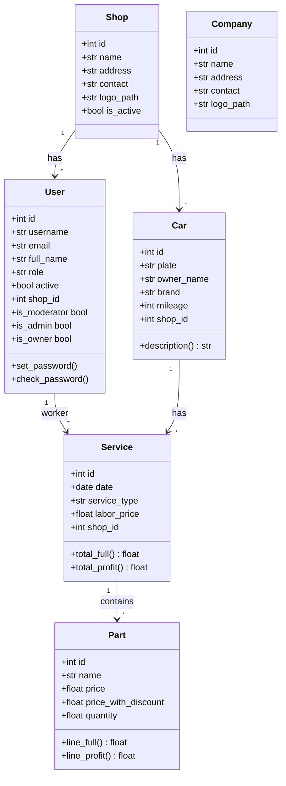

# Data Models

`app/models.py` defines the six SQLAlchemy models that form the application's data layer. All tables live in a single SQLite database (`instance/carservice.db`).

## Model Relationships

## Shop

Represents a service shop / tenant. Moderators create shops; each admin (owner) is assigned to one. Fields: `name`, `address`, `contact`, `logo_path`, `is_active`, `created_at`. Has one-to-many relationships with `User` and `Car`.

## User

Extends Flask-Login's `UserMixin`. Three roles defined by constants:
- `ROLE_MODERATOR = "moderator"` — system-level super-admin, sees all shops, manages tenants.
- `ROLE_ADMIN = "admin"` — shop owner, sees all services within their shop, manages users.
- `ROLE_WORKER = "radnik"` — sees only their own services.

Each user has a `shop_id` FK linking to their assigned shop (nullable for moderators).

Key methods:
- `set_password(password)` / `check_password(password)` — bcrypt-style hashing via Werkzeug.
- `is_moderator` property — checks `self.role == ROLE_MODERATOR`.
- `is_admin` property — `True` if role is `ROLE_ADMIN` or `ROLE_MODERATOR`.
- `is_owner` property — `True` only for `ROLE_ADMIN` (shop owner specifically).
- `is_active` property — maps to the `active` column (Flask-Login interface).

## Company

A **single-row** table (always `id=1`) holding the shop's identity: name, address, contact info, and logo path. Populated on first run via the [Dashboard & Setup](main.md) page.

## Car

Indexed by `plate` (unique). Tracks vehicle details (brand, model, engine, fuel type, year), owner contact info, photo, and last-known mileage. Has a one-to-many relationship with `Service` (cascade delete-orphan).

The `description` property produces a human-readable summary like `"BMW 320 2.0 dizel 2020"`.

Fuel types are defined as a constant list: `benzin`, `dizel`, `ev`, `benzin/plin`, `hibrid`.

## Service

Links a `Car` to a `worker` (User) for a specific date. Stores labor price/description, odometer reading, and `shop_id` for multi-tenant scoping. Parts are a cascade-delete-orphan relationship.

### Service types

Each service has a `service_type` field (indexed) with one of:

| Constant | Label |
|----------|-------|
| `SERVICE_TYPE_POPRAVKE` (`"popravke"`) | Popravke (repairs) |
| `SERVICE_TYPE_VULKANIZERSKI` (`"vulkanizerski"`) | Vulkanizerski radovi (tire work) |
| `SERVICE_TYPE_MALI_SERVIS` (`"mali_servis"`) | Mali servis (oil change) |

Service types are used for filtering and analytics breakdowns across the dashboard, reports, and moderator panel.

### Derived price properties

| Property | Formula | Meaning |
|----------|---------|---------|
| `parts_total_full` | Σ part.line_full | What the customer pays for parts |
| `parts_total_cost` | Σ part.line_cost | Shop's actual parts cost |
| `parts_profit` | full − cost | Margin on parts |
| `total_full` | labor + parts_full | Total charged to customer |
| `total_profit` | labor + parts_profit | Shop's total profit |

These properties drive the [Pricing & Profit Model](../architecture/pricing.md) used throughout [Reports](reports.md) and [Printing](printing.md).

## Part

Each part has two price columns:
- `price` — retail / full price (what the customer sees).
- `price_with_discount` — shop's purchase cost (with supplier discount).

Line totals multiply by `quantity`:
- `line_full = price × quantity`
- `line_cost = price_with_discount × quantity`
- `line_profit = line_full − line_cost`

## Connections

- Used by every blueprint: [Service Records](services.md), [Car Management](cars.md), [Authentication & Users](auth.md), [Reports & Analytics](reports.md), [Printing & PDF](printing.md)
- Created/migrated by `init_db.py`
- Pricing logic documented in [Pricing & Profit Model](../architecture/pricing.md)

# Citations
- app/models.py:1
- app/models.py:9
- app/models.py:13
- app/models.py:16
- app/models.py:29
- app/models.py:46
- app/models.py:87
- app/models.py:101
- app/models.py:120
- app/models.py:135
- app/models.py:165
- app/models.py:181
