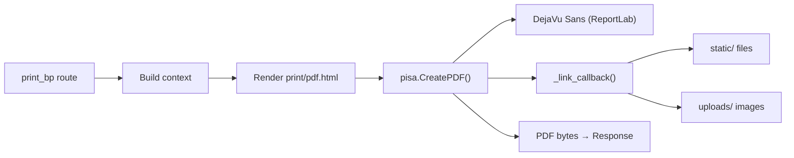

# Printing & PDF

`app/printing.py` defines the `print_bp` blueprint for generating printable views of service records. Two output formats are supported: **HTML** (opens the browser's print dialog) and **PDF** (downloadable file via xhtml2pdf). Each format has two modes: **customer** copy and **owner** copy.

## Print modes

| Mode | Content shown | Use case |
|------|--------------|----------|
| **Customer** (`mode=customer`) | Parts at retail price only, no labor price, no profit | Receipt for the car owner |
| **Owner** (`mode=owner`) | Full breakdown: labor, retail + cost prices, profit margins | Internal record for the shop owner |

## Endpoints

| Route | Function | Output |
|-------|----------|--------|
| `/print/service/<id>` | `service()` | HTML print of one service |
| `/print/car/<id>` | `car()` | HTML print of all services for a car |
| `/pdf/service/<id>` | `service_pdf()` | PDF download of one service |
| `/pdf/car/<id>` | `car_pdf()` | PDF download of all car services |

All routes accept a `?mode=customer|owner` query parameter (defaults to `customer`).

## Context builders

Two private functions build the template context:
- `_service_context(service_id)` — single service with its car.
- `_car_context(car_id)` — all services for a car, sorted by date ascending. Workers see only their own services.

Both enforce access control via `_can_access()` (same logic as [Service Records](services.md)).

## PDF generation (`app/pdf.py`)

`render_pdf(html)` converts an HTML string to PDF bytes using `xhtml2pdf.pisa`. Key details:

- **DejaVu Sans font** is registered directly with ReportLab (not via CSS `@font-face`) to avoid a Windows temp-file lock bug. This ensures Serbian characters (č, ć, đ, š, ž) render correctly.
- **Link callback** maps `/static/...` and `/media/...` URLs to absolute filesystem paths so images (logo, car photos) embed in the PDF.
- A dedicated template `print/pdf.html` uses table-based layout because xhtml2pdf supports only a subset of CSS (no flexbox).

## Connections

- Uses [Data Models](models.md) — `Service`, `Car`
- Access control same as [Service Records](services.md)
- PDF font and layout separate from HTML print template
- Linked from [Car Management](cars.md) detail page and [Service Records](services.md) detail page

# Citations
- app/printing.py:1
- app/printing.py:13
- app/printing.py:18
- app/printing.py:29
- app/printing.py:44
- app/printing.py:50
- app/printing.py:57
- app/printing.py:72
- app/printing.py:79
- app/pdf.py:1
- app/pdf.py:17
- app/pdf.py:36
- app/pdf.py:47
