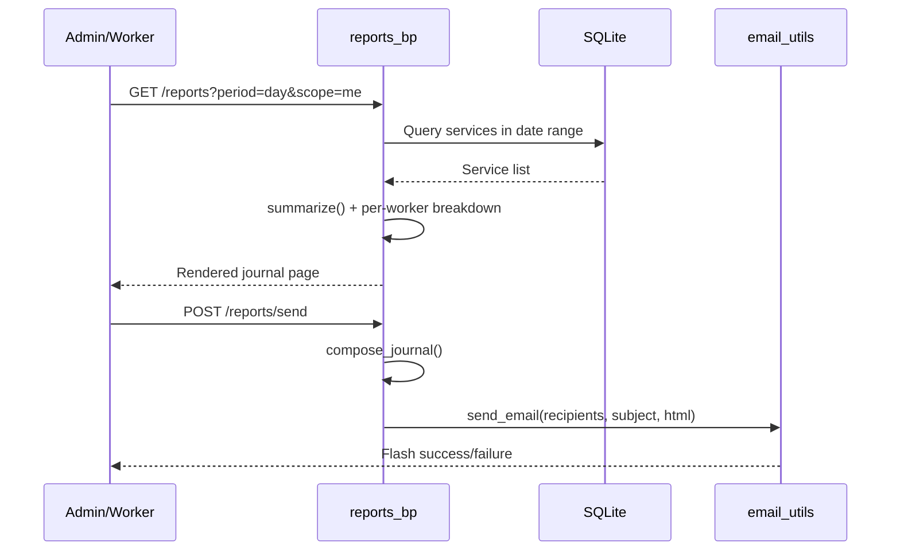

# Reports & Analytics

`app/reports.py` defines the `reports_bp` blueprint providing two main features: **journals** (periodic service summaries) and **analytics** (interactive profit/revenue charts).

## Journals (`/reports`)

Journals summarize services for a selected period (day / week / month) and scope (single worker or shop-wide "all"). The `compose_journal()` function is the core — it's a **pure function** (doesn't read `current_user`) so it can be called from both web requests and the background [Scheduler](../architecture/scheduler.md).

### Journal flow

### Scope resolution

`_resolve_scope(scope, worker_param)` enforces permissions:
- Workers always see only their own data regardless of `scope` parameter.
- Admins can choose: `"me"` (themselves), `"all"` (shop-wide), or `"worker:<id>"` (specific worker).

### Summarize function

`summarize(services)` returns a dict with: `count`, `parts_full`, `parts_cost`, `parts_profit`, `labor`, `revenue`, `profit`. Used for both overall totals and per-worker breakdowns.

## Analytics (`/analytics`)

A custom date-range analysis page with four Chart.js charts:
1. **Revenue/profit over time** — bar + line combo chart (daily or monthly buckets).
2. **Revenue structure** — doughnut: parts (retail) vs. labor.
3. **Parts price comparison** — bar: retail vs. cost vs. margin.
4. **Profit per worker** — horizontal bar (admin-only, shop-wide scope).

The `_build_charts()` function assembles all chart data server-side as JSON, embedded into the template as a `#chartData` element consumed by [analytics.js](../modules/app/static/js.md).

### Time bucketing

For ranges over 62 days, data is bucketed monthly (labeled with abbreviated Serbian month names via `SR_MONTHS`). Shorter ranges use daily buckets.

## E-mail delivery

The `send()` endpoint delivers a journal via e-mail:
- **Worker journal** → sent to the worker's e-mail.
- **Overall journal** → sent to all active admins.

Uses `send_email()` from `app/email_utils.py` (SMTP, configurable via [Configuration](../architecture/configuration.md)).

## Key symbols

| Symbol | Role |
|--------|------|
| `compose_journal(period, ref, worker, scope_label)` | Build journal dict (reusable from scheduler) |
| `summarize(services)` | Aggregate financials for a service list |
| `_build_charts(...)` | Assemble Chart.js data series |
| `index()` | GET `/reports` — journal page |
| `send()` | POST `/reports/send` — e-mail journal |
| `analytics()` | GET `/analytics` — charts page |

## Connections

- Uses [Data Models](models.md) — `Service`, `User`
- Called by [Scheduler](../architecture/scheduler.md) for automatic journal dispatch
- Formatting via [Utilities](utils.md) (`period_range`, `sr_date`, `PERIOD_LABELS`, `SR_MONTHS`)
- Charts rendered by [Frontend & Static Assets](../modules/app/static/js.md) (`analytics.js`)
- SMTP via `email_utils.py`, configured in [Configuration](../architecture/configuration.md)

# Citations
- app/reports.py:1
- app/reports.py:18
- app/reports.py:80
- app/reports.py:91
- app/reports.py:102
- app/reports.py:115
- app/reports.py:144
- app/reports.py:172
- app/reports.py:206
- app/email_utils.py:1
