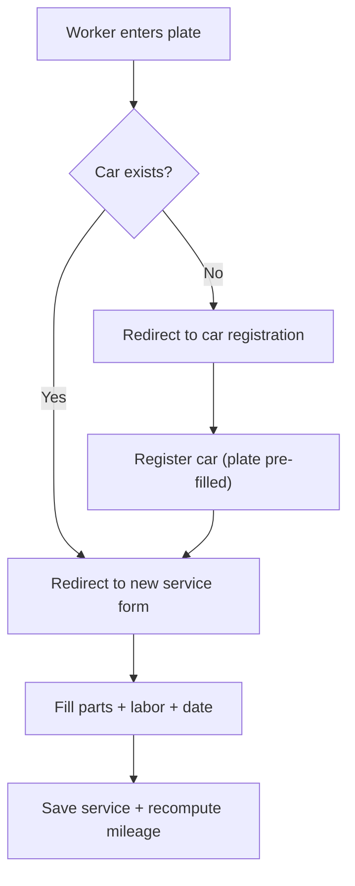

# Service Records

`app/services.py` defines the `services_bp` blueprint — the core business logic of the application. It implements the **plate-first workflow** for creating service records, plus CRUD operations for managing them.

## Plate-first workflow

The design philosophy: a mechanic starts by entering the car's license plate, not by navigating menus.

## Endpoints

| Route | Method | Function | Description |
|-------|--------|----------|-------------|
| `/service/start` | GET/POST | `start()` | Enter plate → find or register car |
| `/service/new?car_id=X` | GET/POST | `new()` | Create service for car X |
| `/service/<id>` | GET | `detail(id)` | View service details |
| `/service/<id>/edit` | GET/POST | `edit(id)` | Edit service |
| `/service/<id>/delete` | POST | `delete(id)` | Delete service |
| `/services` | GET | `list_services()` | List all services (filterable by plate and service type) |
| `/service/parse-invoice` | POST | `parse_invoice_upload()` | OCR an invoice image/PDF and return parsed parts as JSON |

## Access control

The helper `_can_access(service)` returns `True` if the current user is admin or is the worker who created the service. Used on detail, edit, and delete routes — non-matching workers get a 403.

## Parts management

`_rebuild_parts(service, form)` replaces the service's entire parts list on every save:
1. Deletes all existing `Part` rows.
2. Reads parallel form arrays: `part_name[]`, `part_qty[]`, `part_price[]`, `part_disc[]`.
3. Creates new `Part` objects with name, quantity, retail price, and discounted (cost) price.

This approach keeps the form simple (add/remove rows dynamically via [Frontend JS](../modules/app/static/js.md)) and avoids partial-update complexity.

## Mileage recompute

`_recompute_car_mileage(car)` finds the most recent service (by date, then id) with a non-null mileage reading and sets `car.mileage` to that value. This ensures:
- Editing an older service never overwrites a newer odometer reading.
- Deleting the latest service falls back to the previous reading.

Called after every create, edit, and delete.

## Service types

Each service is assigned a `service_type` from the `SERVICE_TYPES` list (popravke, vulkanizerski, mali servis). The type is set on create/edit and defaults to `SERVICE_TYPE_POPRAVKE`. The service list page allows filtering by type, and types are used for analytics breakdowns.

## Invoice OCR (`/service/parse-invoice`)

The endpoint accepts an uploaded invoice image (JPEG, PNG, BMP, WebP, TIFF) or PDF, runs Tesseract OCR via `app/invoice_parser.py`, and returns parsed parts as JSON. The parser:
- Converts PDFs to images via `pypdfium2`.
- Extracts parts from the standard Serbian auto-parts invoice format (catalog number, description, quantity, unit, retail price, discounted price).
- Handles OCR artifacts in number parsing (mangled decimals, missing commas).
- Cross-references multiple pages to merge names from one page with discount prices from another.

## Form helpers

- `_apply_service_form(service, form)` — parses date, mileage, labor price, labor description, and service type from the POST data.
- `_to_int(value)` / `_to_float(value)` — tolerant parsers that strip spaces and handle comma/dot decimal separators (Serbian locale).

## Connections

- Uses [Data Models](models.md) — `Car`, `Service`, `Part`, `SERVICE_TYPES`
- Invoice OCR via `app/invoice_parser.py` (Tesseract + pypdfium2)
- Multi-tenant scoping via `scoped_query()` from `security.py`
- Plate normalization mirrors [Car Management](cars.md)
- Dynamic form powered by [Frontend & Static Assets](../modules/app/static/js.md) (`service_form.js`)
- Results feed into [Reports & Analytics](reports.md) and [Printing & PDF](printing.md)
- Pricing logic documented in [Pricing & Profit Model](../architecture/pricing.md)

# Citations
- app/services.py:1
- app/services.py:15
- app/services.py:19
- app/services.py:22
- app/services.py:42
- app/services.py:65
- app/services.py:93
- app/services.py:107
- app/services.py:125
- app/services.py:140
- app/services.py:155
- app/services.py:169
- app/services.py:186
