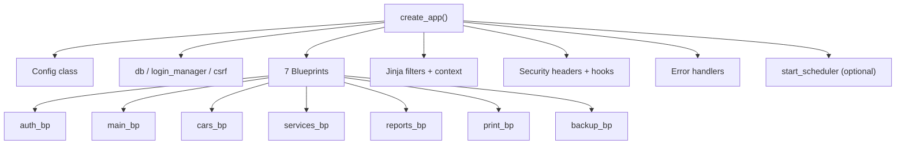

# Application Factory

The `app/__init__.py` module implements the **Flask application factory pattern** via `create_app()`. This single function is the bootstrap point for the entire application — it configures extensions, registers all seven blueprints, sets up Jinja template helpers, security middleware, error handlers, and optionally starts the background scheduler.

## How `create_app()` works

1. **Create the Flask instance** and load the `Config` class.
2. **Ensure directories** exist: `INSTANCE_DIR`, `BACKUP_DIR`, and upload sub-folders (`cars/`, `logo/`).
3. **Reverse-proxy support**: if `TRUST_PROXY` is set, applies Werkzeug's `ProxyFix` middleware for correct `X-Forwarded-*` header handling (needed when behind nginx on the Pi).
4. **Initialise extensions**: `db` (SQLAlchemy), `login_manager` (Flask-Login), `csrf` (Flask-WTF CSRF protection) — all defined in `extensions.py`.
5. **Register blueprints**: `auth_bp`, `main_bp`, `cars_bp`, `services_bp`, `reports_bp`, `print_bp`, `backup_bp`.
6. **Media route**: `/media/<path:filename>` serves uploaded files (login-required).
7. **Jinja helpers**: `currency` and `srdate` filters, plus context-injected globals (`company`, `FUEL_LABELS`, `ROLE_LABELS`, `PERIOD_LABELS`, `currency_code`).
8. **Before-request hook**: rejects (logs out) deactivated users mid-session.
9. **After-request hook**: sets security headers (CSP, X-Frame-Options, X-Content-Type-Options, Referrer-Policy).
10. **Error handlers**: 403, 404, 413, 500, and CSRFError (400).
11. **Scheduler**: if `ENABLE_SCHEDULER` is true, starts APScheduler via `start_scheduler(app)`.

## SQLite pragmas

A SQLAlchemy engine-level `connect` listener (applied globally) sets three pragmas on every new database connection:

- `PRAGMA journal_mode=WAL` — Write-Ahead Logging for better concurrent reads.
- `PRAGMA foreign_keys=ON` — enforces FK constraints.
- `PRAGMA busy_timeout=30000` — 30-second wait instead of immediate "database is locked" errors.

This is critical for reliable operation on the Pi under light concurrent use.

## Key symbols

| Symbol | Role |
|--------|------|
| `create_app(config_class)` | Factory function; returns configured Flask app |
| `_set_sqlite_pragma()` | Engine connect listener for SQLite tuning |
| `_reject_deactivated()` | Before-request hook to log out disabled users |
| `_security_headers()` | After-request hook adding CSP and other headers |

## Connections

- Loads settings from [Configuration](../architecture/configuration.md)
- Uses extensions from `extensions.py` (`db`, `login_manager`, `csrf`)
- Registers blueprints documented in: [Authentication & Users](../files/app/auth.md), [Dashboard & Setup](../files/app/main.md), [Car Management](../files/app/cars.md), [Service Records](../files/app/services.md), [Reports & Analytics](../files/app/reports.md), [Printing & PDF](../files/app/printing.md), [Backup System](../files/app/backup.md)
- Optionally starts the [Scheduler](../architecture/scheduler.md)
- Injects helpers from [Utilities](../files/app/utils.md) into Jinja

# Citations
- app/__init__.py:1
- app/__init__.py:17
- app/__init__.py:30
- app/__init__.py:39
- app/__init__.py:61
- app/__init__.py:76
- app/__init__.py:86
- app/__init__.py:93
- app/__init__.py:100
- app/__init__.py:130
- app/extensions.py:1
