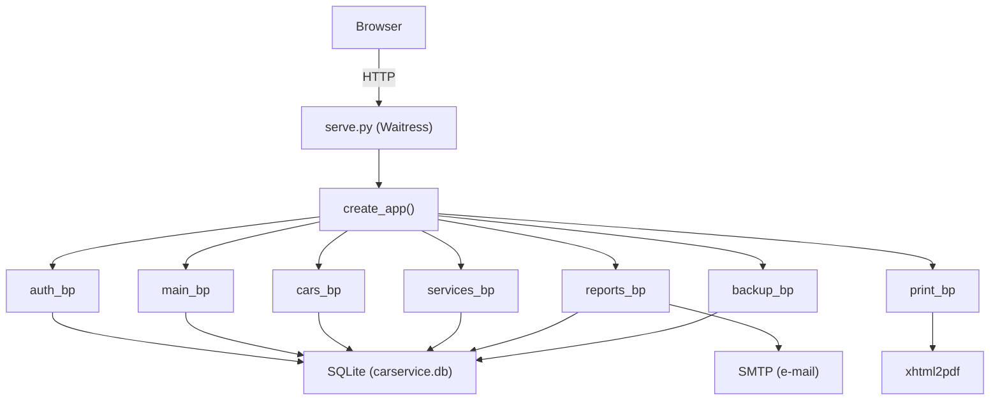

# Overview

**Auto Servis** is a lightweight web application for managing an auto mechanic shop. Built with Python (Flask) and SQLite, it is designed to run on hardware as modest as a **Raspberry Pi Zero 2W** — no Docker required — as well as on Windows for development and testing.

The interface language is **Serbian (Latin script)**.

## What it does

- **Two account types**: administrator and worker (radnik). The first registered user automatically becomes admin.
- **Vehicle registry** by license plate, tracking owner, mileage, brand/model/engine/fuel/year, and photo.
- **Service records** with a parts table (retail vs. cost price), labor description + price, date, and mileage update.
- **Plate-first workflow**: enter a plate → if the car exists, create a service; if not, register it first, then proceed.
- **Printing**: customer copy (no labor, retail prices only) and owner copy (full breakdown with profit). Available as browser print or PDF download.
- **Journals**: daily / weekly / monthly reports by worker or shop-wide, with e-mail delivery via SMTP.
- **Analytics**: profit charts, parts price comparison (retail vs. cost vs. margin), revenue structure — powered by Chart.js.
- **Backups**: consistent SQLite online-backup zipped with uploaded media, with admin UI and automatic nightly scheduling.

## Tech stack

| Layer | Technology |
|-------|-----------|
| Backend | Python 3, Flask 3.0, Flask-SQLAlchemy, Flask-Login, Flask-WTF |
| Database | SQLite (WAL mode, busy timeout for Pi concurrency) |
| WSGI server | Waitress (pure-Python, cross-platform) |
| PDF | xhtml2pdf + DejaVu Sans font for Serbian glyphs |
| Images | Pillow (resize on upload) |
| Scheduler | APScheduler (journal e-mails + nightly backup) |
| Frontend | Bootstrap 5, Chart.js, custom JS (dark theme, dynamic parts form) |
| Config | python-dotenv (.env file) |

## Architecture

The application follows the **Flask app-factory pattern**. `create_app()` in `app/__init__.py` initialises extensions, registers seven blueprints, sets up Jinja filters, security headers, error handlers, and optionally starts the background scheduler.

## Key pages in this wiki

- [Application Factory](modules/app.md) — how the app is wired together
- [Data Models](files/app/models.md) — User, Company, Car, Service, Part
- [Authentication & Users](files/app/auth.md) — login, roles, throttling
- [Dashboard & Setup](files/app/main.md) — home page and company config
- [Car Management](files/app/cars.md) — vehicle CRUD
- [Service Records](files/app/services.md) — the plate-first workflow
- [Reports & Analytics](files/app/reports.md) — journals and charts
- [Printing & PDF](files/app/printing.md) — print views and PDF export
- [Backup System](files/app/backup.md) — database backup and restore
- [Utilities](files/app/utils.md) — formatting, images, periods
- [Scheduler](architecture/scheduler.md) — automatic journal e-mails and backups
- [Frontend & Static Assets](modules/app/static/js.md) — JS and UI
- [Security Architecture](architecture/security.md) — CSRF, headers, throttling
- [Pricing & Profit Model](architecture/pricing.md) — revenue vs. cost vs. profit
- [Configuration](architecture/configuration.md) — .env settings
- [Deployment](architecture/deployment.md) — Pi, Windows, systemd

# Citations
- README.md:1
- app/__init__.py:1
- app/__init__.py:30
- app/__init__.py:61
- app/__init__.py:130
- serve.py:1
- requirements.txt:1
- app/config.py:1
